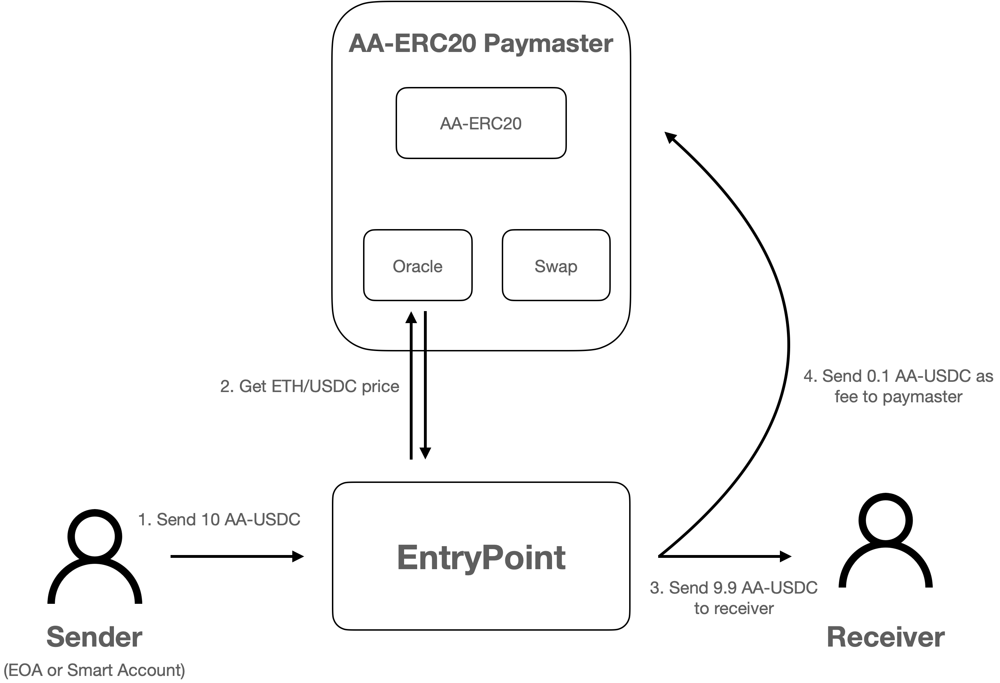
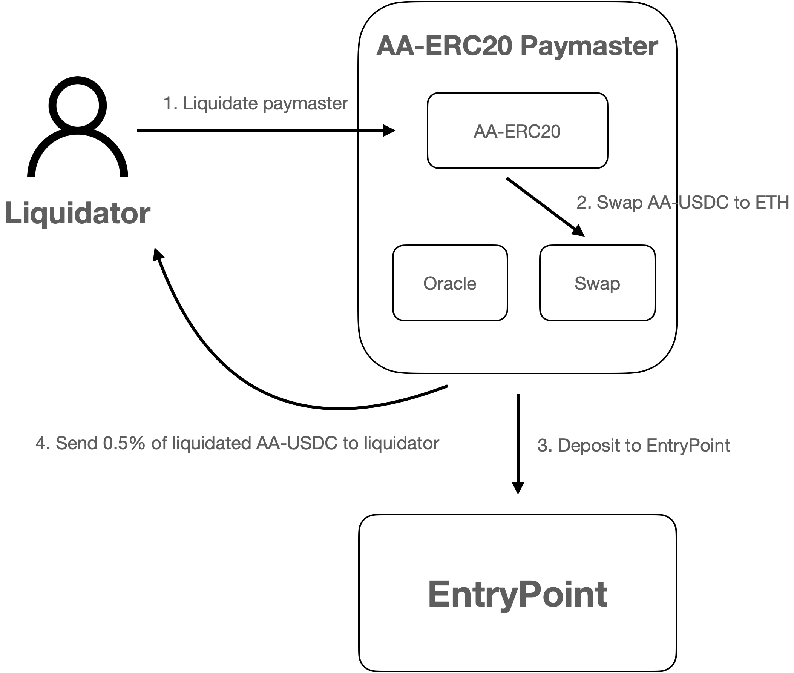

## AA-ERC20 Paymaster

AA-ERC20 Paymaster is a permissionless fee-on-transfer ERC20 protocol which enable accounts to pay gas fee with "AA-ERC20" token.

## Motivation
Most existing paymasters operate on a permissioned basis or require specific pre-activation procedures. For instance, the Verifying Paymaster system relies on a third party to sponsor gas fees. Similarly, the ERC20 Paymaster mandates the execution of an "approve" call prior to its usage. 


This setup can be cumbersome and compromise the privacy of smart accounts, particularly those using stealth address plugins, due to the inherent permissions and activations involved.


## Solution
The AA-ERC20 Paymaster addresses these challenges by integrating the capabilities of "AA-ERC20" and "Permissionless ERC20 Paymaster." This fusino enables the wrapping of ERC20 tokens into AA-ERC20 tokens, which can then be used to pay gas fees. The protocol permits anyone to act as the paymaster's liquidator, ensuring the paymaster remains permissionless and solvent.

### AA-ERC20


### Permissionless ERC20 Paymaster


### Feature
- Eliminates the need for a third party to pay gas fees.
- Allows gas fee payment without any prior setup or activation.
- Supports fee-on-transfer tokens for transactions from both smart accounts and EOAs.
- Create paymaster with any customized ERC20 token, oracle and swap.

## Usage

### Build

```shell
$ forge build
```

### Test

```shell
$ forge test
```
